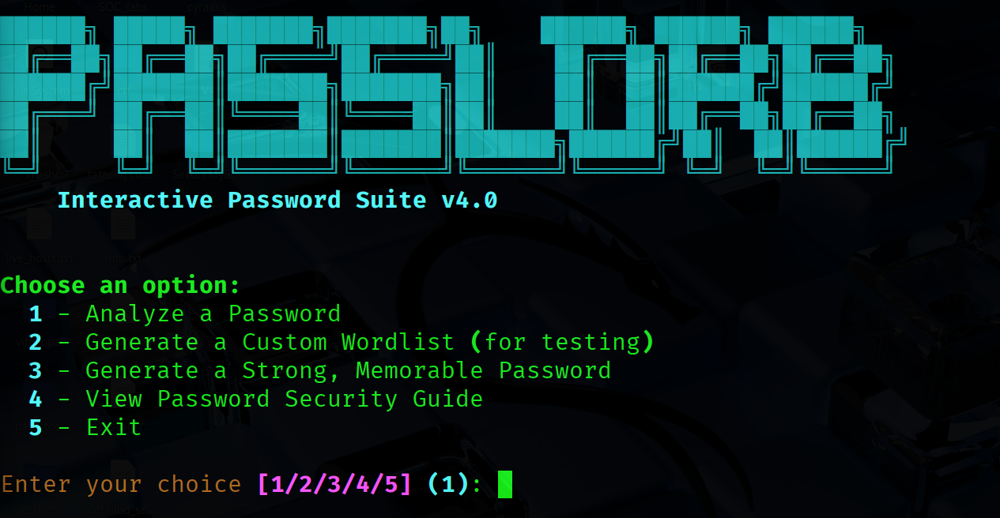
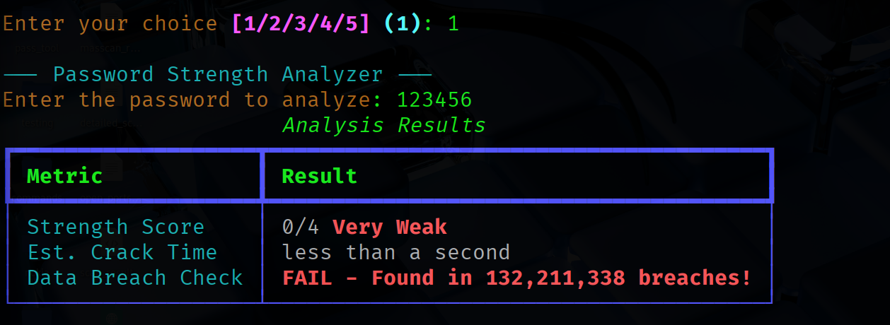

# PassGenius: Interactive Password Suite


<strong>A modern, interactive command-line tool for password strength analysis, secure passphrase generation, and security education.</strong>
</p>

## Features
- PassGenius is more than just a password checker; it's a complete suite of tools designed to enhance your digital security.

- `Advanced Password Analysis`: Instantly analyze any password's strength. The tool provides a score, an estimated crack time, and checks it against billions of breached passwords using the `Have I Been Pwned`API—all without ever exposing your password online.

- `Strong Password Generator`: Creates strong and secure password suggestions based on your input. The tool intelligently combines your memorable keywords with random elements to generate passwords that are difficult to crack but easier for you to remember.

- `Custom Wordlist Generator`: For security researchers and penetration testers, this feature allows you to generate context-aware wordlists based on personal keywords, perfect for simulating targeted password attacks.

- `Built-in Security Guide`: A concise, easy-to-read guide on modern password best practices, helping you understand the `why` behind password security.

- `Beautiful & Interactive UI`: Built with rich, the tool provides a polished, user-friendly experience right in your terminal.

## Getting Started

Prerequisites
`Python 3.7+`

Installation

```
Step 1:  Clone the repository:

Step 2:  git clone https://github.com/your-username/passinfo.git

Step 3:  cd passinfo

Step 4:  Create and activate a virtual environment
```

Linux/macOS:

`python3 -m venv venv
source venv/bin/activate
`

Windows:

`
python -m venv venv
.\venv\Scripts\activate
`

Install the required dependencies:
`
pip install -r requirements.txt
`

## Usage

- To start the tool, simply run the main script:

`python passinfo.py`

You will be greeted with the main menu, where you can choose from the available options.






Technology Stack

- `zxcvbn-python`: For realistic and powerful password strength estimation.

- `rich`: For creating beautiful and interactive command-line interfaces.

- `requests`: For making secure HTTP requests to the 'Have I Been Pwned' API.

- `PyYAML`: Used for parsing YAML files in the wordlist generator.

## 🤝 Contributing

Contributions are welcome! If you have ideas for new features, improvements, or bug fixes, please feel free to:

- Fork the repository.

- Create a new branch (`git checkout -b feature/YourAmazingFeature`).

- Commit your changes (`git commit -m 'Add some AmazingFeature'`).

- Push to the branch (`git push origin feature/YourAmazingFeature`).

- Open a Pull Request.

