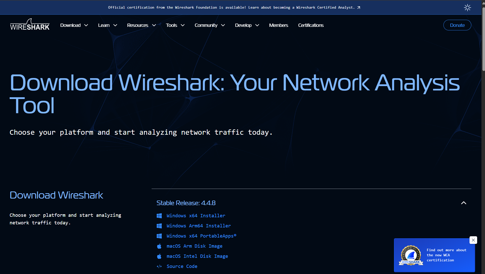
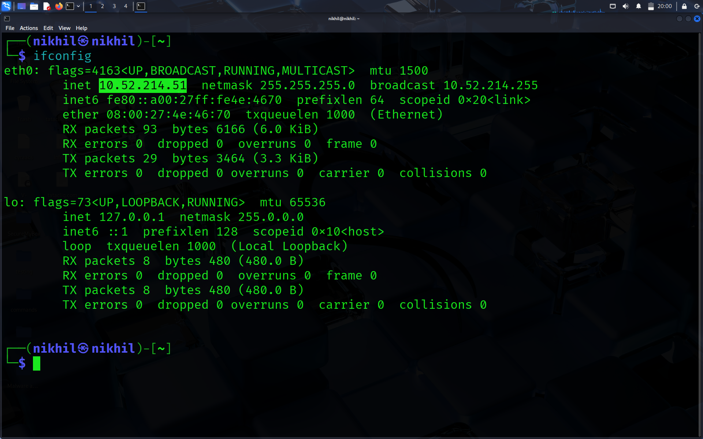
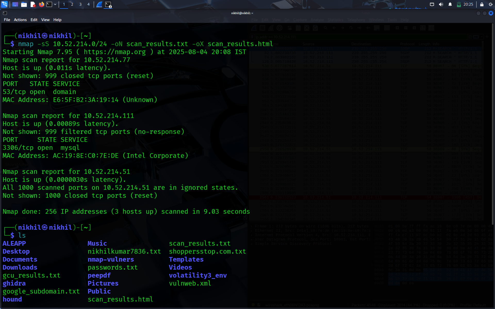
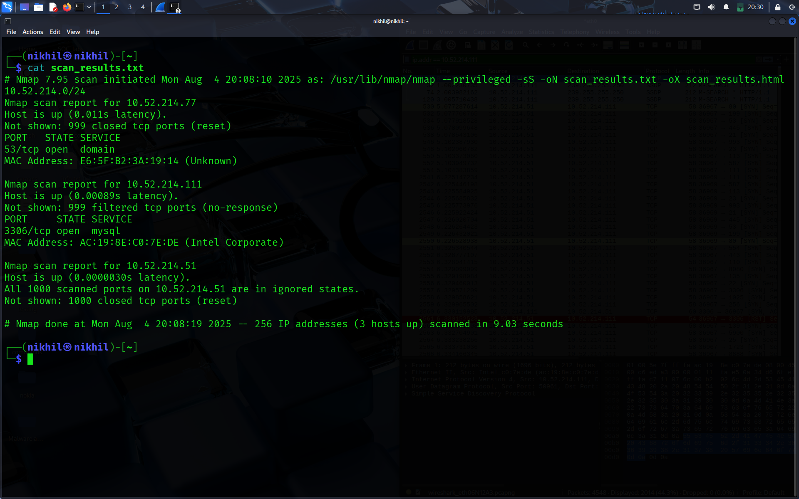
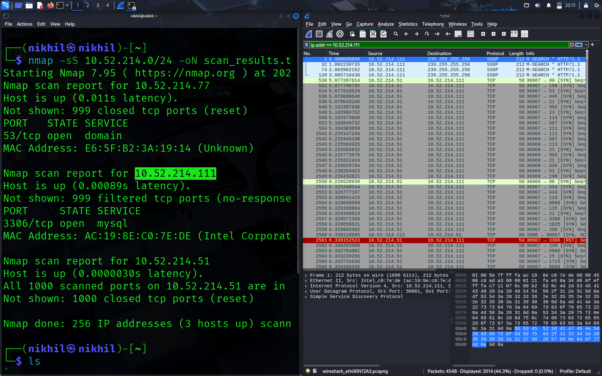

# Network Scanning and Analysis

This repository contains tools, scripts, and documentation for scanning a local network to identify open ports and understand network exposure. This project is part of the Elevate Labs internship task, designed to help learners explore network security concepts using `Nmap` and optionally `Wireshark`.

## Objective
The goal is to learn how to discover open ports on devices within a local network to assess network exposure. By identifying open ports and their associated services, users can evaluate potential security risks and gain insights into network configuration.

## Contents
- `scan_results.txt`: Placeholder for raw Nmap scan output.
- `scan_results.html`: Placeholder for HTML-formatted Nmap scan output .
- `screenshots/`: Directory for storing Nmap and Wireshark screenshots .

## Prerequisites
To complete this task, ensure the following tools and permissions are in place:
- **Nmap**: A powerful open-source tool for network scanning and discovery. Download and install from: [nmap.org](https://nmap.org/download.html).
  


- **Wireshark (Optional)**: A packet analysis tool for capturing and inspecting network traffic. Download from [wireshark.org](https://www.wireshark.org/download.html).


  
- **Permissions**: You must have explicit authorization to scan the target network. Unauthorized scanning is illegal and unethical.

## Setup
Follow these steps to set up the project environment:

1. **Install Nmap**:
   - **Windows**: Download the installer from [nmap.org](https://nmap.org/download.html) and follow the setup wizard.
   - **Linux**: Install via package manager (e.g., `sudo apt-get install nmap` for Ubuntu).
   - **macOS**: Use Homebrew (`brew install nmap`) or download from the Nmap website.
   - Verify installation: `nmap --version`.

2. **Install Wireshark (Optional)**:
   - Download from [wireshark.org](https://www.wireshark.org/download.html) and install.
   - Ensure you have permissions to capture packets (e.g., on Linux, add your user to the `wireshark` group).
   - Verify installation: Open Wireshark and confirm it can capture packets.

## Usage
Follow these steps to perform the network scan and analyze results:

1. **Determine Your Local IP Range**:
   - Identify the IP range of your local network (e.g., `192.168.1.0/24`).
   - **Windows**: Open Command Prompt and run:
     ```bash
     ipconfig
     ```
     Look for the IPv4 address and subnet mask under your active network adapter (e.g., `192.168.1.100` with subnet mask `255.255.255.0` indicates range `192.168.1.0/24`).
   - **Linux/macOS**: Run:
     ```bash
     ifconfig
     ```
     or
     ```bash
     ip addr
     ```
  
     
              Find the IP address and subnet (e.g., `192.168.1.0/24`).

2. **Run the Nmap Scan**:
   Execute the provided Python script to perform a TCP SYN scan:
   ```bash
   nmap -sS <ip-address> -o scan_results.txt 
   ```

   
   
   - The script uses Nmap’s `-sS` (TCP SYN scan) for stealthy and efficient scanning.
   - Results are saved to `scan_results.txt` (raw text) and `scan_results.html` (formatted HTML).
  

4. **Analyze Scan Results**:

   
   
   - **Text Output**: Open `scan_results.txt` to view raw scan results, including:
     - Host IP addresses and hostnames.
     - Open ports, their states (e.g., `open`, `closed`, `filtered`), and associated services (e.g., `http`, `ssh`).
   - **HTML Output**: Open `xdg-open scan_results.html` in a browser for a formatted view of the scan results.
   
   - Research common services using [IANA Service Names and Port Numbers](https://www.iana.org/assignments/service-names-port-numbers/):
     - Port 80: HTTP (web server).
     - Port 22: SSH (secure shell).
     - Port 445: SMB (file sharing, potentially vulnerable).
   - Identify security risks:
     - Unnecessary open ports (e.g., 23/Telnet is insecure).
     - Exposed services (e.g., 3389/RDP may allow remote access if misconfigured).
     - Document findings and recommend mitigations (e.g., closing unused ports, enabling firewalls).

6. **Optional Wireshark Analysis**:
   - Launch Wireshark and select the network interface connected to your local network.
   - Apply a filter to capture traffic for the scanned IP range:
     ```plaintext
     ip.addr == 10.52.124.0/24
     ```
     
   - Start the packet capture, then run the Nmap scan.
   - Analyze captured packets to observe TCP SYN packets and responses.
   - Save screenshots of the packet list or specific packet details in the `screenshots/` directory.
   - **Note**: Do not commit screenshots to GitHub, as they may reveal sensitive network information.

## Screenshots
The `screenshots/` directory is designated for storing screenshots of Nmap and Wireshark outputs to visually document the scanning process. Examples include:

- **Nmap Screenshots**:
  - Terminal output of `nmap -sS <ip-range>` showing scanned hosts and open ports.
  - View of `scan_results.txt` displaying formatted scan results.
    
- **Wireshark Screenshots**:
  - Packet capture window filtered for the scanned IP range, showing TCP SYN packets and responses.
  - Detailed view of a specific packet (e.g., TCP handshake for an open port).

**Instructions for Capturing Screenshots**:
1. **Nmap**:
   - Run `nmap -sS 10.52.124.0/24` and capture the terminal window using a screenshot tool (e.g., Snipping Tool on Windows, `Cmd+Shift+4` on macOS).
   - Open `scan_results.html` in a browser and screenshot the formatted output.
   - Save as `screenshots/nmap1.png` or `screenshots/nmap2.png`.
     
2. **Wireshark**:
   - Start Wireshark, select the appropriate network interface, and apply the filter `ip.addr == 10.52.124.0/24`.
   - Run the Nmap scan while capturing packets.
   - Screenshot the packet list or a specific packet’s details (e.g., TCP SYN/ACK for an open port).
   - Save as `screenshots/nmap1.png` or `screenshots/nmap2.png`.
     
3. **Storage**: Store screenshots in the `screenshots/` directory. These are excluded from Git commits via `.gitignore`.
4. **Usage**: Reference screenshots in reports, presentations, or documentation for the internship task, ensuring no sensitive details (e.g., IP addresses, hostnames) are exposed publicly.

## Security and Privacy Considerations
- **Legal Compliance**: Scanning networks without permission is illegal and unethical. Ensure you have explicit authorization from the network owner before scanning.
  
- **Data Sensitivity**: Scan results (`scan_results.txt`, `scan_results.html`) and screenshots may contain sensitive information, such as IP addresses, hostnames, or open services. Do not share these publicly or commit them to GitHub.
  
- **Risk Assessment**:
  - Open ports like 23 (Telnet) or 445 (SMB) may indicate vulnerabilities.
  - Exposed services (e.g., 3389/RDP) could allow unauthorized access if not secured.
  - Research each open port’s service and assess whether it should remain open or be closed (e.g., via firewall rules).
    
- **Mitigation**: Close unnecessary ports, update services, and enable firewalls to reduce network exposure.

## Example Workflow
1. Identify your network’s IP range:
   ```bash
   ipconfig  # Windows
   ifconfig  # Linux/macOS
   ```
   Example output: IP `10.52.124.51`, subnet mask `255.255.255.0` → Range `192.168.1.0/24`.

2. Run the scan:
   ```bash
   nmap -sS 192.168.1.0/24
   ```
   - Output files: `scan_results.txt`, `scan_results.html`.
   - Example result in `scan_results.txt`:
     ```
     Host: 192.168.1.1 (router.local)
     State: up
     Protocol: tcp
     Port: 80  State: open  Service: http
     Port: 443 State: open  Service: https
     ```

3. Analyze with Wireshark:
   - Start Wireshark, filter for `ip.addr == 192.168.1.0/24`, and capture packets during the scan.
   - Observe TCP SYN packets and responses (e.g., SYN/ACK for open ports, RST for closed ports).

4. Research and Document:
   - Use [IANA Service Names](https://www.iana.org/assignments/service-names-port-numbers/) to identify services (e.g., port 80 is HTTP).
   - Note risks (e.g., port 23/Telnet is insecure; recommend disabling).
   - Save screenshots in `screenshots/` for documentation.

## Troubleshooting
- **Nmap Error**: If `nmap: command not found`, ensure Nmap is installed and added to your system’s PATH.
- **Permission Denied**: Run the script with `sudo` if Nmap requires elevated privileges (common on Linux).
  
  ```bash
  sudo nmap -sS 192.168.1.0/24
  ```
- **Wireshark No Packets**: Ensure the correct network interface is selected and the filter is properly set.
- **Invalid IP Range**: Verify the IP range format (e.g., `192.168.1.0/24`) matches your network as here mine is `10.52.124.0/24` .

