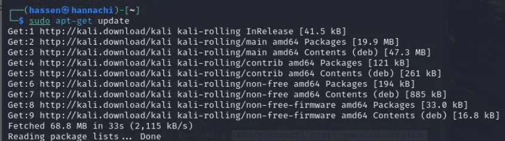
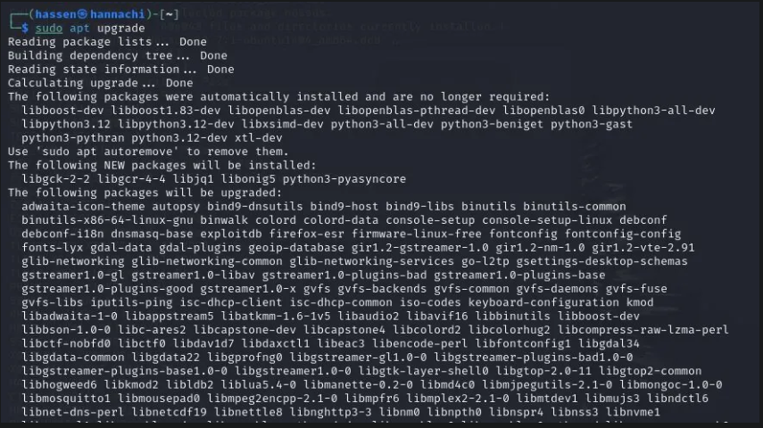
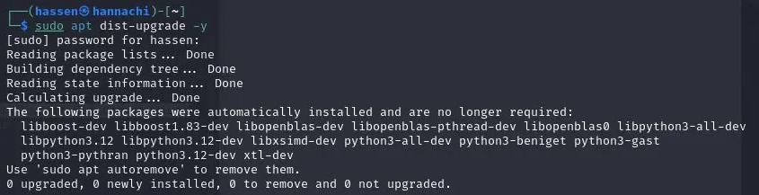
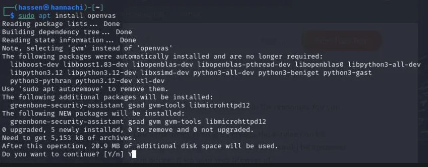
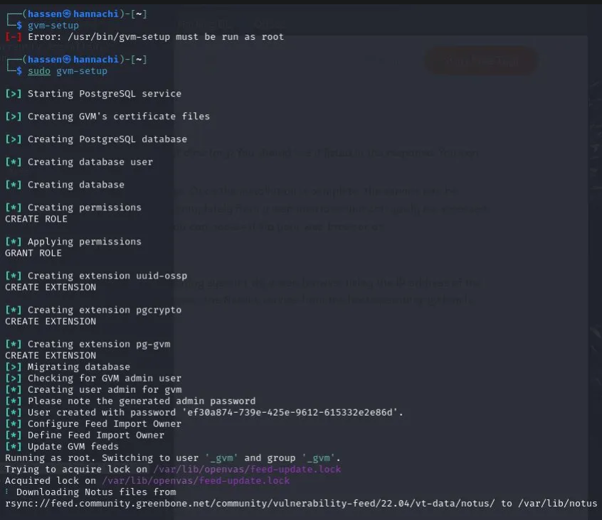
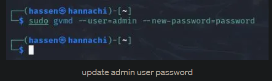
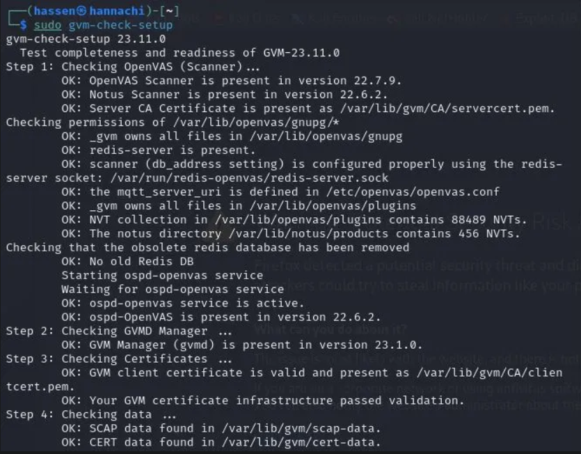
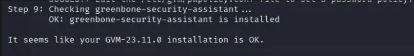
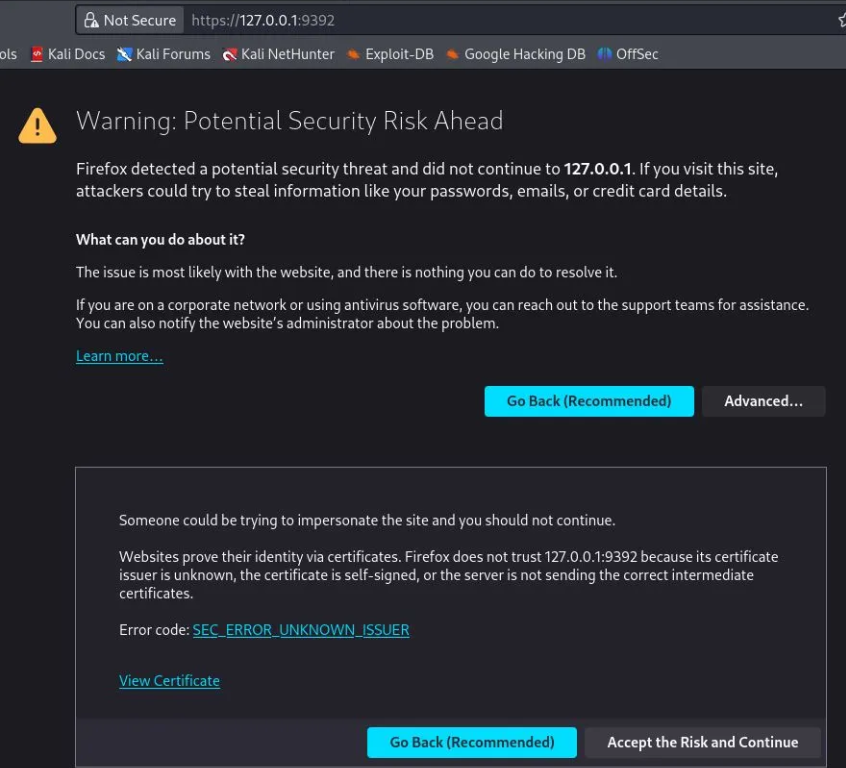
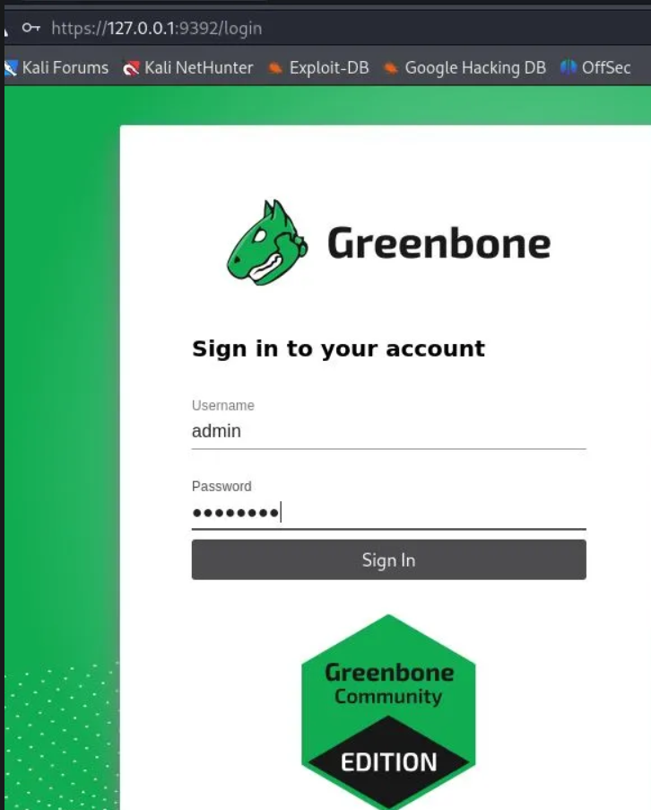

# Vulnerability Scanning Using Openvas

### OpenVAS Installation and Configuration Guide for Kali Linux

This guide provides step-by-step instructions for preparing a Kali Linux system, installing OpenVAS (also known as GVM), and performing vulnerability scanning.

## Prerequisites
- A Kali Linux system (latest version recommended).
- Administrative privileges (`sudo` access).
- Internet connection for downloading updates and vulnerability definitions.

## Step 1: Update Kali Linux
Ensure your Kali Linux system is up to date to avoid compatibility issues.

```bash
sudo apt update
sudo apt upgrade -y
sudo apt dist-upgrade -y
```
 

  

  


## Step 2: Install OpenVAS (GVM)
Install OpenVAS and its dependencies.

```bash
sudo apt install openvas
```
 

Alternatively, you can use:

```bash
sudo apt install gvm
```

## Step 3: Run the OpenVAS Setup
Configure OpenVAS and download Network Vulnerability Tests (NVTs). This process may take significant time and bandwidth due to the large number of vulnerability definitions (50,000+).

```bash
sudo gvm-setup
```
 
 
### Notes
- The setup process downloads Notus files, NASL files, SCAP data, CERT-Bund data, and gvmd data.
- An admin account is automatically created with a generated password, displayed at the end of the setup output. Save this password for later use.

## Step 4: Password Management
If you need to reset the admin password or create a new user, use the following commands.

### Reset Admin Password
```bash
sudo gvmd --user=admin --new-password=passwd
```
 

### Create a New User
```bash
sudo runuser -u _gvm -- gvmd --create-user=admin2 --new-password=12345
```

### Change Existing User Password
```bash
sudo runuser -u _gvm -- gvmd --user=admin --new-password=new_password
```

## Step 5: Verify the Installation
Check if OpenVAS is set up correctly.

```bash
sudo gvm-check-setup
```

 

   

### Troubleshooting
If you encounter an error indicating missing SCAP data, review the error message for specific fix instructions, such as re-running the setup or downloading missing files.

## Step 6: Start and Stop OpenVAS Services
OpenVAS services consume significant resources, so it’s recommended to stop them when not in use.

### Start OpenVAS Services
```bash
sudo gvm-start
```

 

  

### Stop OpenVAS Services
```bash
sudo gvm-stop
```

## Step 7: Access the Web Interface
After starting the services, access the OpenVAS web interface at:

```
https://localhost:9392
```

### Notes
- You may need to manually open the browser to access the URL.
- The first time you visit, you’ll encounter a security warning due to a self-signed certificate. Click **Advanced** and **Accept the Risk and Continue**.
- Log in using the admin credentials (auto-generated or reset).

## Step 8: Configure a New Scan Target
1. Navigate to **Scans > Tasks** in the web interface.
2. Click the purple **magic wand** icon to start the basic configuration wizard.
3. Set up an initial scan for the local host to verify the setup.
4. Allow sufficient time for the scan to complete.
5. Monitor scan progress and results via the OpenVAS dashboard.

## Step 9: Perform Vulnerability Scanning
To initiate a vulnerability scan and obtain results, follow these steps:

1. **Navigate to the Test Section**:
   - In the web interface, go to **Scans > Tasks**.

2. **Launch the Scan Wizard**:
   - Locate the **purple magic wand** icon in the top-left corner of the **Tasks** page and click it to open the scan configuration wizard.
   - The wizard provides a user-friendly interface to configure scan settings.

3. **Choose Scan Type**:
   - The wizard offers options for **Quick Scans** or **Detailed Scans**:
     - **Quick Scan**: Performs a faster scan with basic checks, suitable for initial assessments.
     - **Detailed Scan**: Conducts a comprehensive scan with in-depth vulnerability checks, which may take longer but provides more thorough results.
   - Select the desired scan type based on your requirements.

4. **Configure the Scan**:
   - Specify the target (e.g., `localhost` or a specific IP address).
   - Optionally, adjust scan settings such as port range or specific vulnerability tests (NVTs) if needed.
   - Save the configuration to create a new task.

5. **Start the Scan**:
   - Once configured, start the scan by clicking the **Play** button next to the task in the **Tasks** list.
   - Scanning may take time depending on the target and scan type. Monitor progress in the web interface.

6. **View Scan Results**:
   - After the scan completes, navigate to **Scans > Reports** to view the results.
   - Results include detailed information about detected vulnerabilities, severity levels, and remediation recommendations for **Detailed Scans**, or a summary for **Quick Scans**.
   - Use the dashboard to analyze ongoing and completed scans.

### Notes
- **Quick Scans** are ideal for rapid assessments but may miss some vulnerabilities.
- **Detailed Scans** provide comprehensive results but require more time and resources.
- Regularly check scan reports to prioritize and address vulnerabilities.

## Key Notes
- **Persistence**: OpenVAS configurations and rules persist across reboots.
- **Resource Usage**: Stop OpenVAS services when not in use to conserve system resources.
- **Web Interface**: Runs locally on port 9392.
- **Troubleshooting**: If issues arise, check logs or re-run `gvm-check-setup` for diagnostic information.

## Contributing
Contributions to improve this guide are welcome. Please open issues or submit pull requests on GitHub.

## License
This project is licensed under the MIT License.
