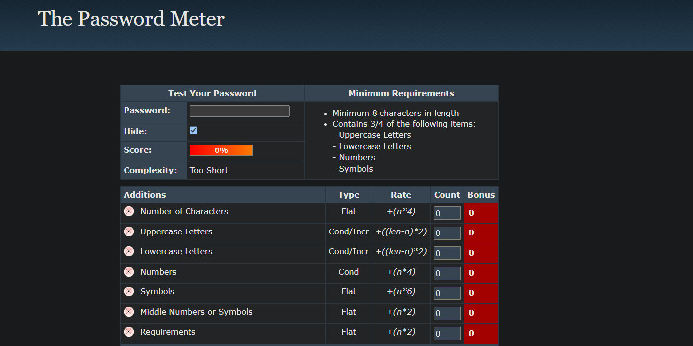
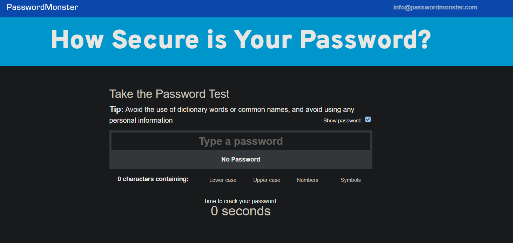
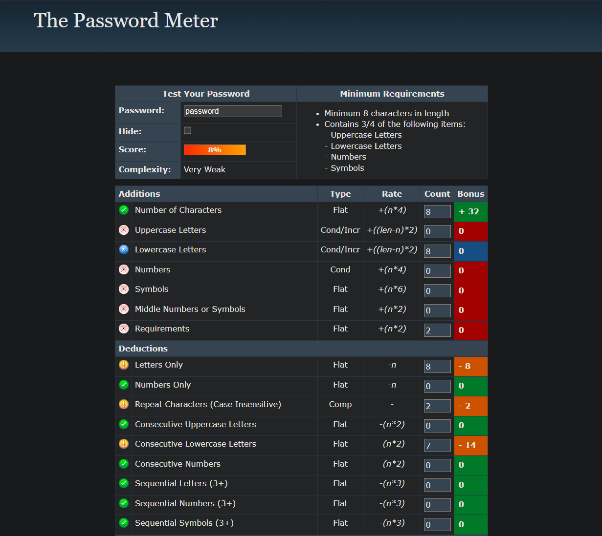
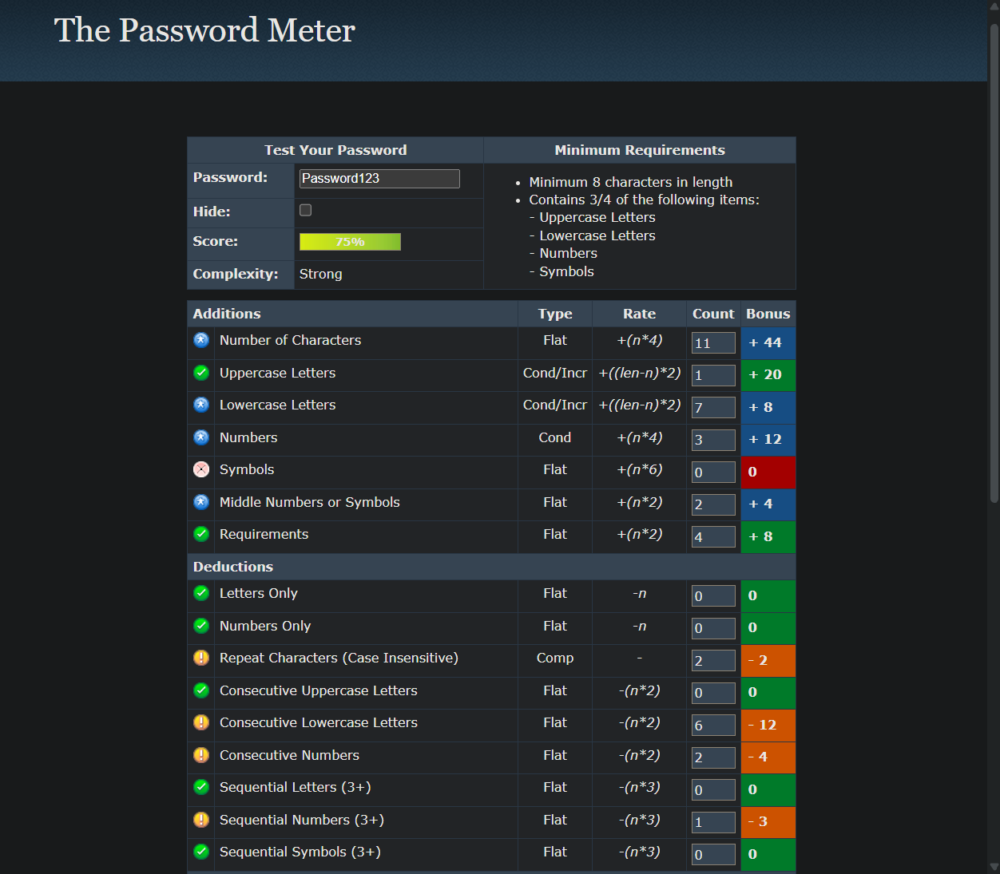
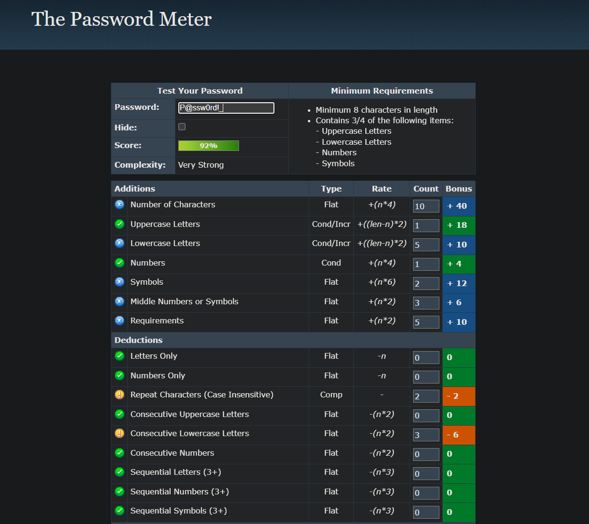
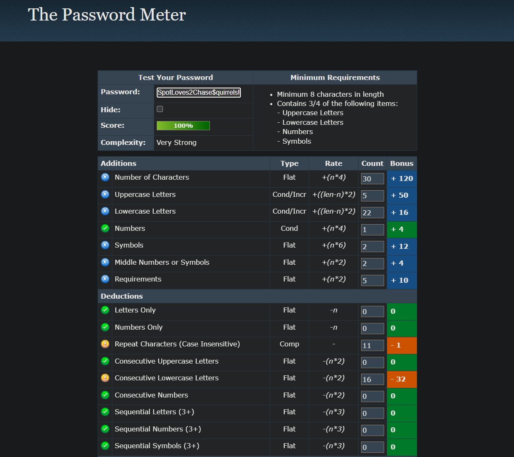
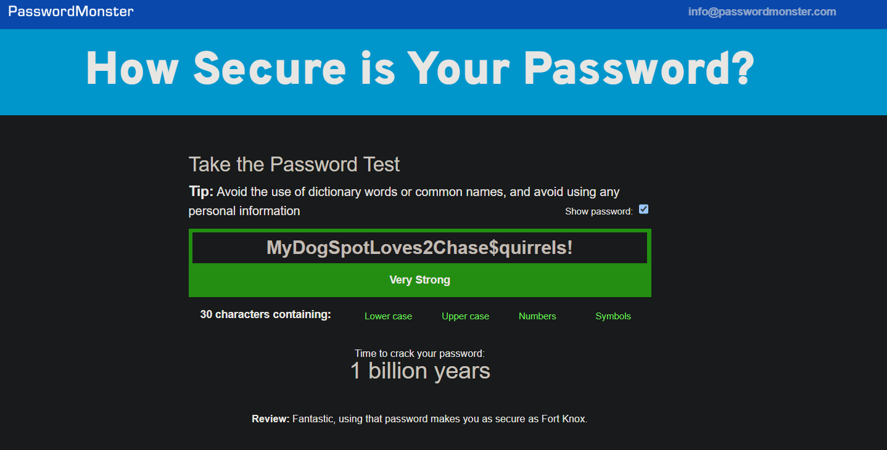
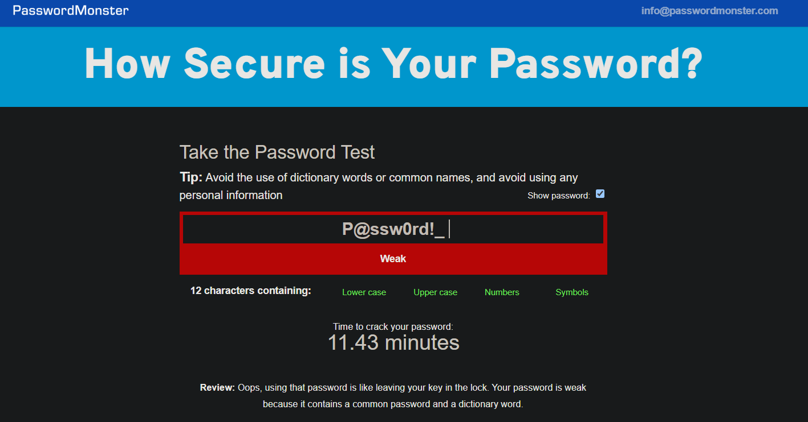

# Password Strength Analysis

This project explores the principles of creating strong, secure passwords. By testing various passwords with an online strength checker, this analysis identifies best practices and explains how password complexity thwarts common cyberattacks.

## Objective
To understand the key factors that contribute to a strong password by creating and evaluating passwords of varying complexity using online tools, and to summarize the findings and best practices for robust password security.

## Methodology & Test Results
The following steps were taken to analyze password strength. The tool used for this analysis was [passwordmonster](https://www.passwordmonster.com/) and [passwordmeter](https://passwordmeter.com/) but any similar tool can be used.

### 1. Password Creation & Testing
A series of passwords were created with increasing complexity to test how length, character types, and structure affect overall strength.

### 2. Strength Analysis
Each password was entered into the password strength checker, and the score and feedback were recorded. The results are summarized in the table below.

---

| Password Tested                        | Length | Character Types Used                | Score/Rating     | Tool Feedback & Analysis                                                                 |
|----------------------------------------|--------|------------------------------------|------------------|------------------------------------------------------------------------------------------|
| password                               | 8      | Lowercase only                    | 8% (Very Weak)  | Deductions for being a dictionary word. Extremely vulnerable.                             |
| Password123                            | 11     | Uppercase, Lowercase, Numbers     | 75% (Good)       | A decent mix, but predictable. The sequential numbers and capitalization pattern are common. |
| P@ssw0rd!_                            | 10     | All 4 types                       | 92% (Very Strong)| Strong score due to the mix of uppercase, lowercase, numbers, and symbols. The use of substitutions (@ for a, 0 for o) helps. |
| MyDogSpotLoves2Chase$quirrels!         | 32     | All 4 types                       | 100% (Very Strong)| Excellent score. Length is the most significant factor here. It's a long, memorable passphrase that includes multiple character types, making it highly resistant to attacks. |

## Key Learnings & Best Practices
Based on the evaluation, the following are the most effective practices for creating strong passwords.

- **Length is King**: A longer password is exponentially harder to crack. Aim for a minimum of 16 characters. As seen in the analysis, the 32-character passphrase received a perfect score primarily due to its length.
- **Embrace Complexity**: Use a combination of all four character types:
  - Uppercase letters (A-Z)
  - Lowercase letters (a-z)
  - Numbers (0-9)
  - Symbols (!, @, #, $, %, etc.)

- **Create a Passphrase**: Instead of a complex, hard-to-remember password, create a long passphrase. For example, `Correct-Horse-Battery-Staple` is much easier for a human to remember but incredibly difficult for a computer to guess.

---

 

 ---

- **Avoid Predictability**: Do not use common substitutions (e.g., `P@ssw0rd`), personal information (birthdays, names), or sequential characters (abc, 123).

---

 

 ---

- **Uniqueness is Key**: Never reuse passwords across different accounts. If one account is compromised, all your other accounts become vulnerable.

## Common Password Attacks Explained
Strong passwords are your first line of defense against common hacking methods.

### Brute-Force Attack
This is a trial-and-error method where an attacker's software systematically tries every possible combination of letters, numbers, and symbols until the correct password is found.

- **How Strength Helps**: Every character you add to your password increases the number of possible combinations exponentially. A short, simple password might be cracked in seconds, while a long, complex passphrase could take trillions of years for a computer to guess.
  - An 8-character password using only lowercase letters has 26^8 possible combinations (~208 billion).
  - A 16-character password using all four character types has roughly 94^16 possible combinations, a massive number that is computationally infeasible to crack.

### Dictionary Attack
This is a more refined version of a brute-force attack. Instead of trying random combinations, the software tries words from a dictionary, common phrases, and previously leaked passwords.

- **How Strength Helps**: Using uncommon words, creating a passphrase with multiple unrelated words, or adding symbols and numbers prevents your password from being found in a hacker's "dictionary." This is why `password` is instantly cracked, but `MyDogSpotLoves2Chase$quirrels!` is secure.

## Summary: How Complexity and Length Secure Your Accounts
Password complexity and length are not arbitrary rules; they are direct countermeasures to the methods attackers use. By creating a long, unique, and complex password (or passphrase) for each of your accounts, you create a statistical barrier that makes it impractical for attackers to guess their way in. A strong password makes brute-force attacks take too long to be worthwhile and ensures it won't be found in a dictionary attack, providing robust security for your digital life.
