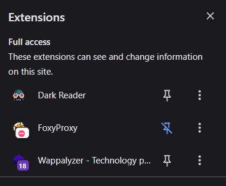
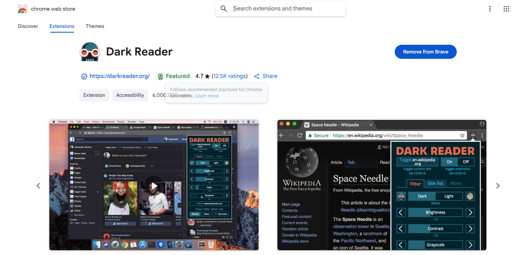
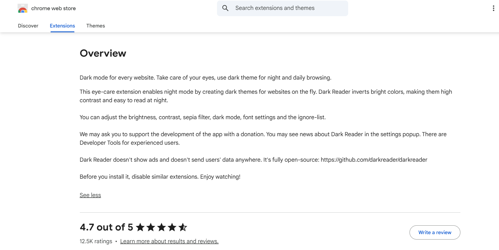
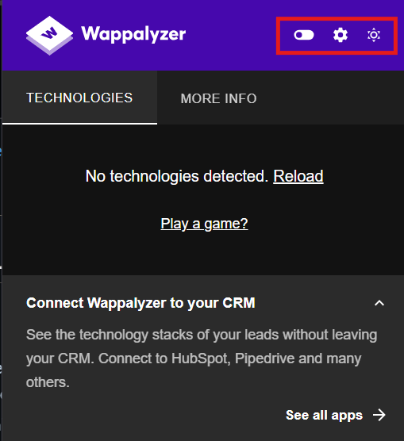

# Browser Extension Security Audit

## Overview

This repository documents a comprehensive security audit of browser extensions installed in my web browser. The primary objective is to evaluate the necessity, safety, and permissions of each extension to enhance browser security and performance. By identifying and reviewing installed extensions, this audit ensures that only essential and trustworthy extensions remain active, minimizing potential security risks.

## Objective

The main goals of this audit are:

- To review all currently installed browser extensions.
- To understand the purpose and permissions of each extension.
- To remove or disable any extensions that are unnecessary, suspicious, or pose a security risk.
- To document findings and actions taken to maintain a secure browsing environment.

## Tools Used

- **Web Browser**: Brave 
- **Browser Extension Manager**: Brave's built-in extension management interface, accessed via the puzzle-piece icon in the toolbar, which displays extensions with access to the current webpage.

## Audit Methodology

The audit was conducted systematically, following these steps:

1. **Accessed Extensions**: Navigated to the extension management menu by clicking the puzzle-piece icon in the Chrome toolbar to view the list of extensions with access to the current webpage.
2. **Initial Review**: Identified three active extensions listed in the menu: **Dark Reader**, **FoxyProxy**, and **Wappalyzer**.
3. **Analyzed Permissions**: Noted that all three extensions have "Full access" permissions, allowing them to "see and change information" on the visited webpage. This high level of access necessitated a deeper investigation.
4. **Researched Each Extension**: Conducted research to verify the functionality, legitimacy, and necessity of each extension, assessing whether their permissions were justified.
5. **Documented Findings**: Recorded detailed findings, including the purpose of each extension, the rationale for actions taken, and the final decision for each.

---

---

## Research: Risks of Malicious Browser Extensions

Prior to the audit, research was conducted to understand the potential dangers posed by malicious or poorly configured browser extensions. Key risks include:

- **Ad Injection**: Malicious extensions may inject intrusive advertisements or pop-ups, disrupting the user experience.
- **Data Theft**: Extensions with excessive permissions can steal sensitive information, such as passwords, cookies, or financial details.
- **Search Hijacking**: Some extensions redirect search queries to malicious or untrustworthy websites.
- **Unauthorized Tracking**: Extensions may track browsing activity across websites, compromising user privacy.
- **Resource Abuse**: Malicious extensions may use system resources for unauthorized activities, such as cryptocurrency mining, leading to performance degradation.

This research underscored the importance of auditing extensions to ensure they are legitimate and necessary.

## Audit Results

The audit focused on the three extensions identified in the browser's extension management menu. Below is a detailed breakdown of the findings, including the function, purpose, and action taken for each extension.

| Extension Name | Function & Purpose | Reason for Action | Action Taken |
| --- | --- | --- | --- |
| **Dark Reader** | Enables a dark theme on websites to reduce eye strain and improve readability. It is a widely used, well-regarded open-source extension with a strong reputation in the community. | The "Full access" permission is necessary for Dark Reader to dynamically apply dark mode styling to webpages. As this extension is used daily for browsing comfort, it is deemed essential. | **Keep** |
| **FoxyProxy** | A proxy management tool that allows users to switch between different proxy servers. It is commonly used by developers and security professionals for testing and accessing region-restricted content. | FoxyProxy requires significant network permissions to function, which could pose a risk if left enabled unnecessarily. It is only used occasionally for development tasks, so disabling it when not in use reduces the attack surface. | **Disable (when not in use)** |
| **Wappalyzer** | A technology profiler that identifies the frameworks, servers, and analytics tools used to build a website. The number '18' on its icon indicates it detected 18 technologies on the audited webpage. | Wappalyzer is a valuable tool for developers but not essential for general browsing. Its permissions to access webpage data are justified for its purpose, but it can be disabled when not needed to minimize risk. | **Disable (when not in use)** |

---

---

### Additional Notes

- **Dark Reader**: Verified as a legitimate and popular extension with a large user base and regular updates. Its permissions are directly tied to its core functionality, and no suspicious behavior was observed.
- **FoxyProxy**: While legitimate, its network-related permissions are powerful and could be exploited if the extension were compromised. Disabling it when not in use aligns with the principle of least privilege.
- **Wappalyzer**: Useful for development work, but its data collection capabilities are unnecessary for everyday browsing. Disabling it by default reduces the risk of unintended data exposure.

---
- Before Disabling it was as mentioned collecting data.
  

- So now disabling it to prevent unnecessary data collecion.
  

---

## Conclusion

The security audit confirmed that all three installed extensions—Dark Reader, FoxyProxy, and Wappalyzer—are legitimate tools aligned with my development workflow and browsing preferences. No overtly malicious extensions were identified during the audit.

However, the audit revealed that **FoxyProxy** and **Wappalyzer** are specialized tools with high-level permissions that are not required for routine browsing. To reduce the browser's attack surface, these extensions have been disabled by default and will only be enabled when needed for specific development tasks. **Dark Reader** remains enabled due to its daily utility and justified permissions.

This audit serves as a reminder to regularly review browser extensions, even those from trusted sources, to ensure they are necessary and appropriately configured. Periodic audits will be conducted to maintain a secure and efficient browsing environment.

## Recommendations for Future Audits

- **Regular Reviews**: Schedule quarterly audits to check for new extensions or changes in existing ones.
- **Permission Analysis**: Use tools like Chrome's extension manager or third-party security scanners to monitor permission changes.
- **Minimalism**: Remove or disable extensions that are no longer in active use.
- **Source Verification**: Only install extensions from trusted sources, such as the Chrome Web Store, and verify developer reputation.
