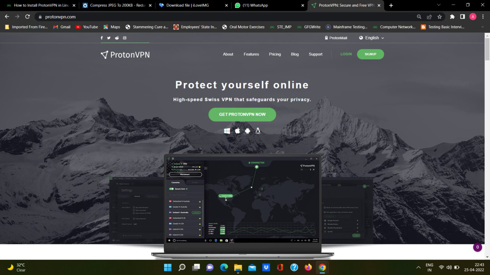
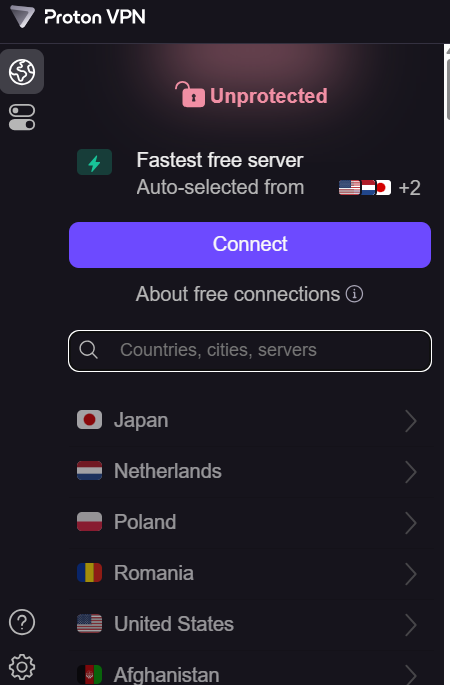
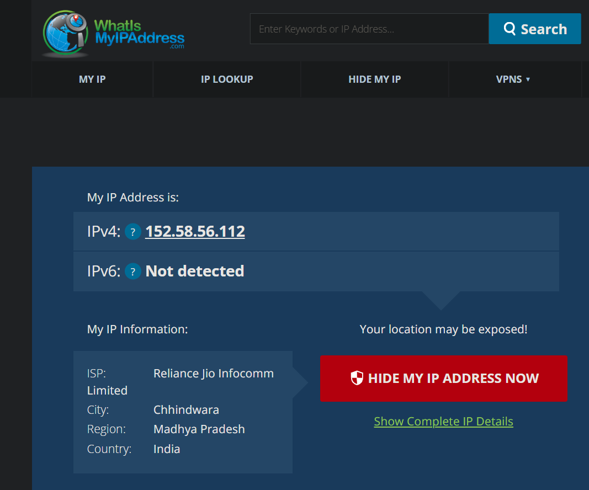
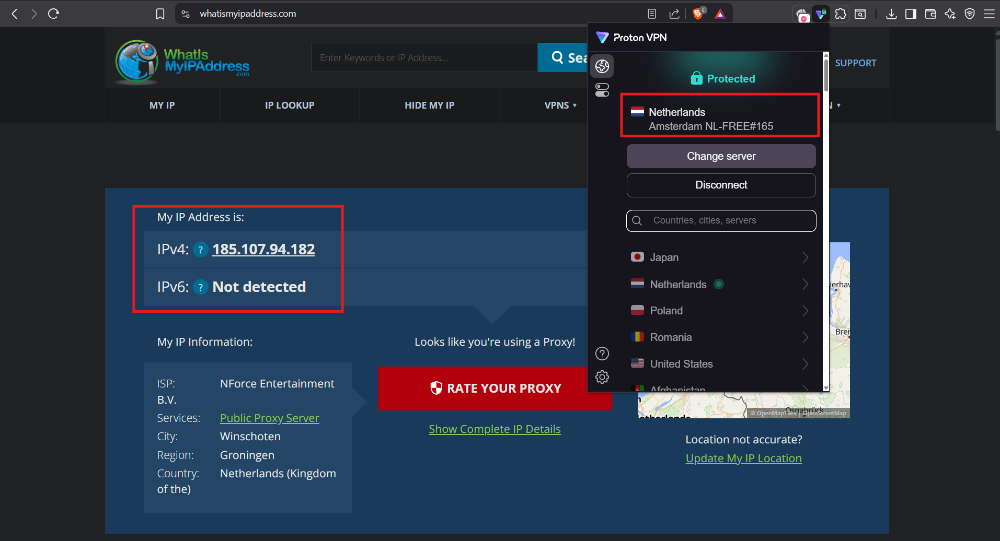
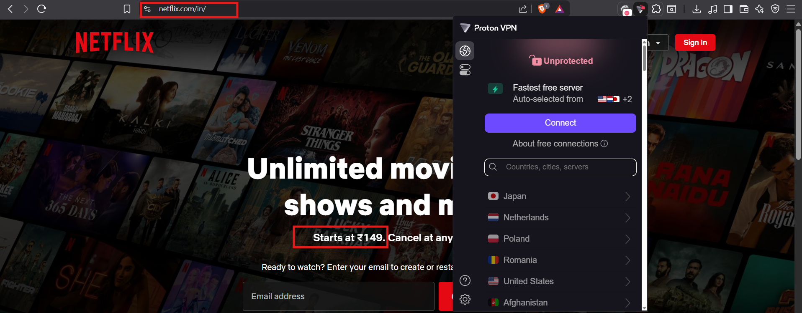
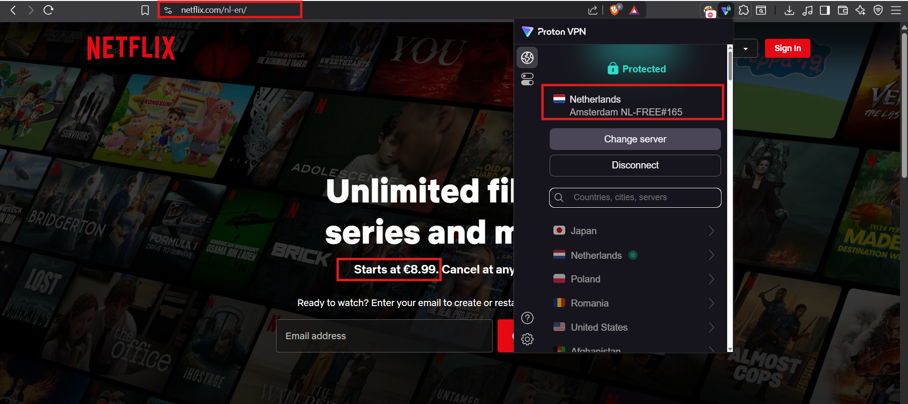
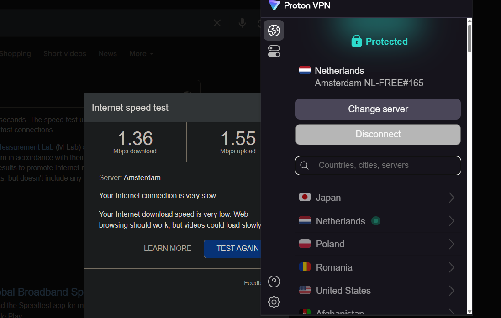

# Easy Guide to Using a VPN in Simple Words

A VPN (Virtual Private Network) is like a secret tunnel for your internet connection. It hides your location and protects your data, making your online activities safer and more private. This guide explains how to use a VPN step-by-step in simple language, plus a clear summary of what VPNs can and can’t do.

## Step-by-Step Guide to Using a VPN

### 1. Pick a Trustworthy Free VPN
- **What to do**: Choose a free VPN service that people trust. Look for one with good reviews and a promise not to track or sell your data (called a "no-logs policy").
- **How to do it**: Search online for “best free VPNs” and check user reviews. Some popular free VPNs are ProtonVPN, Windscribe, or TunnelBear. Go to their official website and sign up with your email.
- **Tip**: Avoid VPNs with bad reviews or ones that seem shady, as they might not keep your data safe.

---

---

### 2. Download and Set Up the VPN App
- **What to do**: Get the VPN app on your phone, computer, or tablet.
- **How to do it**: Visit the VPN’s official website or your device’s app store (like Google Play or Apple App Store). Download the app, open it, and follow the instructions to install it. You may need to log in with the account you made in Step 1.
- **Tip**: Make sure you download from the official site or store to avoid fake apps.

### 3. Connect to a VPN Server
- **What to do**: Use the VPN app to connect to a server, which changes your online location.
- **How to do it**: Open the VPN app and pick a server from the list. If you want faster internet, choose a server close to where you are (like in your country). If you want to access websites from another country (like watching shows only available in the US), pick a server in that country. Click “Connect.”
- **Tip**: The app might connect automatically to the fastest server if you don’t pick one.

### 4. Check If Your IP Address Changed
- **What to do**: Make sure the VPN is hiding your real location.
- **How to do it**: Go to [whatismyipaddress.com](https://whatismyipaddress.com) in your browser. It will show your IP address (a number that identifies your device online). If the VPN is working, the IP address should match the location of the server you chose, not your real location.
- **Tip**: Write down your real IP address before connecting to the VPN so you can compare.

---

- Here we can see that my ip before enabling the vpn was different and after enabling it it changed to Netherland server. 

---

### 5. Browse a Website to Test Encryption
- **What to do**: Visit a website to confirm the VPN is protecting your connection.
- **How to do it**: Open a website, like YouTube or Netflix, and check if it works. If you picked a server in another country, try accessing content only available there (like a show not in your region). Look for a lock icon in your browser’s address bar—it means your connection is secure.
- **Tip**: If a website doesn’t load or blocks you, try a different server in the VPN app.

---

---

### 6. Disconnect the VPN and Compare
- **What to do**: Turn off the VPN to see how it affects your internet.
- **How to do it**: In the VPN app, click “Disconnect.” Go back to [whatismyipaddress.com](https://whatismyipaddress.com) to check that your real IP address is back. Then, visit a website again and notice if it loads faster or slower without the VPN.
- **Tip**: VPNs can slow down your internet a bit because of the encryption, so compare the speed.

---

---

### 7. Learn About VPN Encryption and Privacy
- **What to do**: Understand how the VPN keeps you safe and private.
- **How to do it**: Check the VPN’s website for info on:
  - **Encryption**: This is like a secret code that protects your data. Common types are OpenVPN or WireGuard—both are strong.
  - **No-logs policy**: This means the VPN doesn’t save what you do online. Look for this to stay private.
  - **Extra features**: Some VPNs have a “kill switch” (stops your internet if the VPN disconnects) or “split tunneling” (lets you choose which apps use the VPN).
- **Tip**: Search online for “how VPN encryption works” for simple explanations if you want to learn more.

### 8. Summary of VPN Benefits and Limitations

#### Benefits of Using a VPN
- **Keeps You Private**: A VPN hides your IP address, so websites and your internet provider can’t easily track what you’re doing online.
- **Protects Your Data**: It encrypts your internet connection, especially on public Wi-Fi (like at a café), so hackers can’t steal your info.
- **Unlocks Blocked Content**: You can watch shows or visit websites that are only available in other countries by connecting to a server there.
- **Helps Avoid Censorship**: In places where some websites are blocked, a VPN can let you access them.
- **More Anonymous Online**: A no-logs VPN means no one (not even the VPN company) keeps a record of what you do online.

#### Limitations of Using a VPN
- **Slower Internet**: The encryption and far-away servers can make your internet a bit slower, especially with free VPNs.
- **Free VPNs Have Limits**: Free VPNs often limit how much data you can use, offer fewer servers, or show ads. Paid VPNs usually work better.
- **Not Always Private**: Some free VPNs might track or sell your data. Always check if they have a no-logs policy.
- **Some Websites Block VPNs**: Streaming services like Netflix may block VPN servers, so you might need to try different ones.
- **Legal Risks**: Using a VPN to access blocked content might break some website rules or local laws, so be careful.

## Extra Tips for Beginners
- **Start with Free, Upgrade Later**: Free VPNs are great to try out, but paid ones (like NordVPN or ExpressVPN) often give you faster speeds and more servers.
- **Use on All Devices**: Install the VPN on your phone, laptop, or tablet for protection everywhere.
- **Check for Updates**: Keep the VPN app updated for the best security and features.
- **Ask for Help**: If the VPN isn’t working, check the provider’s website for support or FAQs.

By following these steps, you can easily use a VPN to stay safer online, access more content, and understand its pros and cons. It’s like putting a lock on your internet connection!
